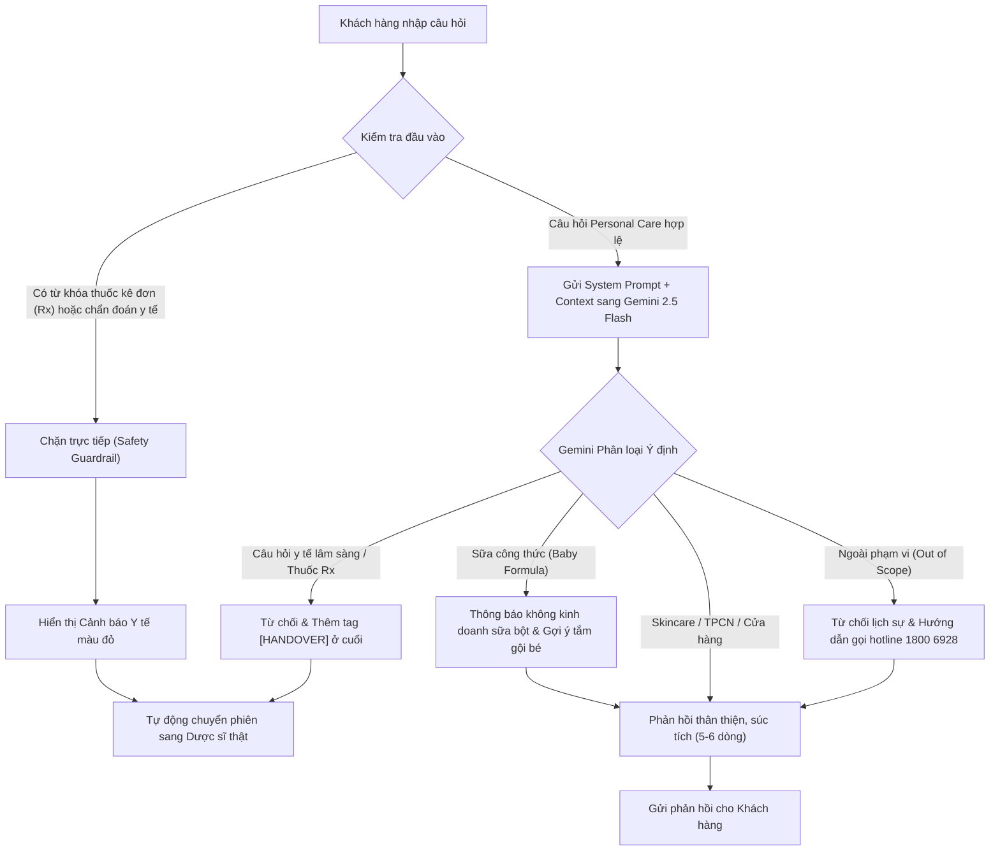

# Phân Tích Toàn Bộ Dự Án: FPT Long Châu AI Chatbot NEO

Dự án này là sản phẩm của **Nhóm 5 - HealthCare AI Squad (Lớp C401)** trong chương trình VinUni AI Product Hackathon. Dự án xây dựng một **Trợ lý ảo AI (Chatbot NEO)** được tích hợp trực tiếp vào trang bán hàng và trang chi tiết sản phẩm của Nhà thuốc FPT Long Châu để tư vấn các sản phẩm chăm sóc cá nhân (Skincare, Thực phẩm chức năng, Chăm sóc em bé) và trang bị cơ chế **Safety Guardrail / Human Handover** giúp đảm bảo an toàn y tế và tuân thủ pháp luật.

---

## 1. Cấu Trúc Dự Án (Directory Structure)

Thư mục làm việc của dự án bao gồm các thành phần chính sau:

```text
c:\Vinuni\Hackathon\
├── README.md                           # Hướng dẫn chung về Day 05 Lab của khóa học
├── products.json                       # Cơ sở dữ liệu sản phẩm gốc dạng JSON (~500KB)
├── scrape.py                           # File script crawl dữ liệu sản phẩm từ file HTML sang products.json
├── scrape_search.py                    # File script crawl song song (dùng ThreadPoolExecutor) từ API tìm kiếm của Long Châu
├── 02-group-spec/                      # Các tài liệu đặc tả chung của nhóm
│   ├── evidence-pack-template.md       # Tài liệu tổng hợp bằng chứng UX và Pain-point
│   ├── synthesis-decide-toolkit.md     # Tài liệu đúc kết insight và đưa ra quyết định sản phẩm
│   ├── thin-spec-template.md           # Bản thiết kế SPEC mỏng cho chatbot
│   └── products.json                   # Bản copy dữ liệu sản phẩm phục vụ đặc tả
├── repo_temp/                          # Thư mục tạm nộp bài Hackathon Day 06
│   ├── README.md                       # Danh sách thành viên nhóm và mô tả ngắn sản phẩm
│   ├── hackathon-rules.md              # Quy chế thi đấu và chấm điểm
│   ├── mo_ta_cong_viec_NEO.md          # Bản mô tả luồng hoạt động và quy tắc Prompt Engineering
│   ├── codebase/                       # Bản copy mã nguồn chạy prototype
│   └── spec/                           # Đặc tả chi tiết sản phẩm (spec.md) kèm hình ảnh bằng chứng
└── longchau_clone/                     # Thư mục chứa mã nguồn chạy ứng dụng chính (Flask)
    ├── .env                            # File chứa khóa cấu hình (như GEMINI_API_KEY)
    ├── .env.example                    # File mẫu cấu hình biến môi trường
    ├── .gitignore                      # Cấu hình bỏ qua các file không cần commit
    ├── app.py                          # File chạy chính của server Flask backend
    ├── feedback_log.json               # Lưu vết phản hồi của người dùng khi sử dụng Chatbot
    ├── products.json                   # File dữ liệu sản phẩm dùng trong app
    ├── stores.json                     # Dữ liệu hệ thống nhà thuốc (chi nhánh, địa chỉ, hotline)
    ├── static_cache/                   # Thư mục đệm lưu trữ các tài sản tĩnh (CSS, JS, Img) từ trang web Long Châu
    └── templates/                      # Thư mục chứa các giao diện HTML
        ├── index.html                  # Giao diện chính của trang chủ FPT Long Châu (Clone tĩnh)
        └── product_detail.html         # Giao diện trang chi tiết sản phẩm tích hợp Chatbot NEO
```

---

## 2. Phân Tích Kiến Trúc Kỹ Thuật (Technical Architecture)

Ứng dụng được xây dựng theo kiến trúc **Client-Server** truyền thống, sử dụng **Python Flask** ở Backend và giao diện **HTML/JS (Vanilla CSS)** ở Frontend.

### 2.1. Backend (`app.py`)
Backend đóng vai trò vừa là máy chủ API, vừa là Proxy chuyển tiếp các file tĩnh từ trang chủ thực tế của Long Châu để tạo trải nghiệm "như thật" cho bản Clone.

#### a. Hệ thống Caching & Proxying
*   Ứng dụng thiết lập một proxy chuyển tiếp cho các tài nguyên từ `nhathuoclongchau.com.vn` (như các file CSS/JS của NextJS, ảnh sản phẩm) thông qua các router như `/_next/...`, `/cdn-cgi/...`, `/estore-images/...`.
*   Các tài nguyên này được lưu đệm (cached) cục bộ trong thư mục `static_cache/` dưới dạng mã băm MD5 để tối ưu hóa tốc độ tải trang ở những lần truy cập sau.
*   Nội dung phản hồi từ Proxy (CSS/JS) được chỉnh sửa động (rewrite) để chuyển các liên kết tuyệt đối của Long Châu thành liên kết tương đối trỏ về localhost.

#### b. API Tương tác dữ liệu
*   `/api/search`: Thực hiện tìm kiếm sản phẩm trong file `products.json` dựa trên các trường thông tin (tên, thương hiệu, thành phần, công dụng).
*   `/api/stores`: Hỗ trợ tìm kiếm cửa hàng Long Châu gần nhất dựa trên quận/huyện hoặc địa chỉ.
*   `/api/product-detail`: Lấy chi tiết thông tin sản phẩm.
*   `/api/feedback`: Cho phép người dùng đánh giá phản hồi (Tốt/Xấu) đối với câu trả lời của AI và lưu vào `feedback_log.json`.

#### c. Tích hợp AI Gemini (`google-genai`)
*   Sử dụng thư viện `google-genai` mới để gọi mô hình **Gemini 2.5 Flash** (với fallback cục bộ bằng NLU đơn giản nếu không có API Key).
*   Mã nguồn tích hợp cơ chế làm sạch lịch sử chat (`call_gemini`), tự động lọc bỏ các câu hỏi cũ đã bị cảnh báo/ngăn chặn để tránh việc AI bị ảnh hưởng bởi ngữ cảnh xấu trước đó.
*   Tự động chèn chỉ dẫn quan trọng: *"CHỈ trả lời câu hỏi MỚI NHẤT của người dùng. Dùng lịch sử chat chỉ để hiểu ngữ cảnh, KHÔNG lặp lại hay trả lời lại các câu hỏi cũ."*

---

## 3. Cơ Chế Safety Guardrail & Human Handover

Đây là điểm nhấn công nghệ cốt lõi của dự án giúp giải quyết rủi ro y tế và pháp lý khi ứng dụng AI vào ngành dược phẩm.



### 3.1. Safety Guardrail (2 Lớp Bảo Vệ)
*   **Lớp 1 (Keyword Blacklist):** Chặn trực tiếp tại backend (`check_safety`) trước khi gọi API Gemini nếu tin nhắn chứa các từ khóa thuốc kê đơn phổ biến (kháng sinh như *ciprofloxacin*, *amoxicillin*, *isotretinoin*,...) hoặc từ khóa liên quan đến chẩn đoán bệnh lý nguy hiểm (*sốt cao*, *tiêu chảy*, *chó cắn*, *tiêm ngừa dại*,...).
*   **Lớp 2 (LLM System Instruction):** System prompt của Gemini quy định cực kỳ nghiêm ngặt:
    1.  Không tự ý chẩn đoán hoặc kê đơn điều trị.
    2.  Nếu phát hiện câu hỏi liên quan đến thuốc đặc trị (Rx) hoặc chẩn đoán lâm sàng phức tạp, LLM sẽ từ chối lịch sự và bắt buộc chèn tag đặc biệt `[HANDOVER]` ở cuối câu trả lời.
    3.  Chặn các câu hỏi ngoài phạm vi (Out-of-Scope) như thời tiết, tin tức, ca nhạc,...

### 3.2. Cơ chế Human Handover (Chuyển giao Dược sĩ)
*   Khi API trả về trạng thái `blocked` hoặc chuỗi phản hồi chứa tag `[HANDOVER]`, hệ thống Frontend sẽ kích hoạt giao diện chuyển giao:
    1.  Phần tiêu đề khung chat đổi từ **🤖 Trợ lý AI NEO** thành **Dược sĩ Trần Thị Hằng** (Dược sĩ chuyên môn trực tuyến).
    2.  Khung chat hiển thị dòng chữ giả lập kết nối và đưa ra lời chào từ Dược sĩ thật yêu cầu gửi đơn thuốc để hỗ trợ.
    3.  Người dùng có nút "Mới" để đặt lại (reset) phiên chat và quay lại trò chuyện với AI NEO.

### 3.3. Xử lý trường hợp đặc biệt (Sữa công thức - Baby Formula)
*   Hệ thống Long Châu không bán sữa công thức cho trẻ em.
*   Thay vì chặn y tế phức tạp, quy tắc Prompt số 5 hướng dẫn AI thông báo lịch sự rằng không kinh doanh sữa bột, đồng thời chủ động gợi ý các sản phẩm tắm gội cho bé có sẵn (như sữa tắm Lactacyd Baby, Cetaphil Baby,...) và **không** chèn thẻ `[HANDOVER]`.

---

## 4. Phân Tích Frontend & Trải Nghiệm Người Dùng (UX)

### 4.1. Trang chủ (`index.html`)
*   Là bản clone của trang chủ Long Châu thực tế.
*   Trang bị đoạn mã JavaScript để chặn và ẩn các widget chat mặc định của Long Châu (như Stringee chat, Zalo chat widget) nhằm làm nổi bật giải pháp Chatbot AI tự phát triển.
*   Bắt các sự kiện click chuột trên toàn trang: Nếu người dùng click vào bất kỳ link sản phẩm nào (`.html`), trang web sẽ chuyển hướng sang trang chi tiết tùy biến của chúng ta: `/product/<slug>`.

### 4.2. Trang chi tiết sản phẩm (`product_detail.html`)
*   Hiển thị thông tin chi tiết đầy đủ của sản phẩm: tên, thương hiệu, giá bán, thành phần hoạt chất, công dụng, cách dùng, cảnh báo & lưu ý.
*   Tích hợp một **AI Chat Panel** cố định ở cột bên phải. Khung chat này tự động nạp thông tin chi tiết của sản phẩm hiện tại làm ngữ cảnh (Context) để trả lời người dùng.
*   Có các nút gợi ý câu hỏi nhanh (Gợi ý cách dùng, thành phần, đối tượng, sản phẩm tương tự) giúp kích thích người dùng tương tác.
*   Tích hợp hệ thống **Giỏ hàng trực quan (Shopping Cart)**:
    *   Người dùng có thể bấm "Chọn mua" trên sản phẩm đang xem hoặc mua nhanh các sản phẩm liên kết do chatbot gợi ý trực tiếp trong khung chat.
    *   Số lượng giỏ hàng được cập nhật theo thời gian thực (real-time badge count) bằng cách lưu trữ trong `localStorage`.

---

## 5. Đánh Giá Điểm Mạnh & Hướng Phát Triển

### 👍 Điểm Mạnh
1.  **Safety Guardrail 2 lớp:** Kết hợp hoàn hảo giữa lọc từ khóa tốc độ cao ở Backend và khả năng hiểu ngữ cảnh (NLU) của Gemini để ngăn chặn rủi ro y khoa tối đa.
2.  **Mượt mà & Nhất quán:** Tự động chuyển giao sang Dược sĩ thật (`[HANDOVER]`) ngay khi phát hiện vượt ngưỡng an toàn giúp nâng cao lòng tin của khách hàng.
3.  **Tương tác giỏ hàng trực tiếp:** Khách hàng có thể bỏ sản phẩm vào giỏ hàng ngay khi chat với AI, rút ngắn luồng chuyển đổi mua hàng (conversion funnel).

### 🚀 Hướng Phát Triển (Future Work)
*   **Tích hợp cơ sở dữ liệu Vector (RAG):** Hiện tại chatbot chỉ tìm kiếm từ khóa thô trong `products.json`. Việc tích hợp Vector Search sẽ giúp AI tìm kiếm sản phẩm theo ngữ cảnh ngữ nghĩa (semantic search) chính xác hơn nhiều.
*   **Trang quản trị Dược sĩ (Handover Dashboard):** Xây dựng một giao diện thực tế cho các Dược sĩ nhận diện yêu cầu, đọc lịch sử chat trước đó của AI và trực tiếp chat với khách hàng.
*   **Tối ưu hóa Blacklist từ khóa:** Cập nhật tự động danh mục hoạt chất y tế kê đơn từ Bộ Y tế để đảm bảo lớp Guardrail 1 luôn được cập nhật.
